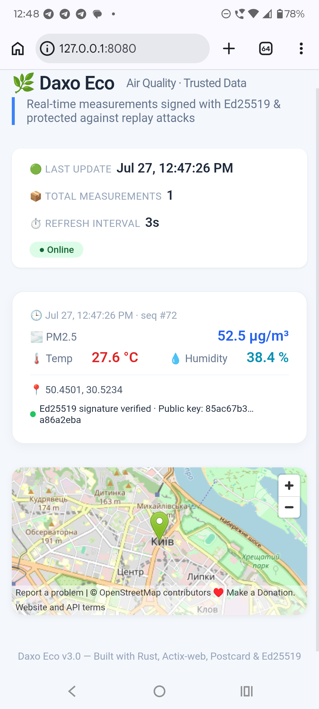

# Daxo Eco
> Lightweight, zero-trust environmental monitoring protocol featuring deterministic binary serialization and hardware-enforced cryptographic telemetry verification.
---
## Overview
**Daxo Eco** is an end-to-end telemetry system designed for constrained embedded devices (such as RISC-V and ARM Cortex-M architectures) operating over untrusted network channels. The architecture shifts the computational overhead of data integrity verification and serialization down to bare-metal primitives, bypassing human-readable formats like JSON/XML during node-to-server transmission.

---
## System Architecture
```
graph LR
    subgraph Embedded Node
        A[Sensors / HAL] --> B[daxo-eco-core <br/> no_std]
        B -->|Ed25519 Sign + Postcard| C(daxo-eco-node)
    end
    
    C -->|Binary Octet-Stream| D[daxo-eco-server <br/> Actix-web]
    
    subgraph Server Pipeline
        D --> E{Security Verification}
        E -->|1. Signature Verification| F[Ed25519 Public Key]
        E -->|2. Sequence Check| G[Anti-Replay Guard]
        F & G -->|Valid| H[(In-Memory Store)]
        H -->|JSON API| I[daxo-eco-web Dashboard]
    end
```
### Core Components
 * **daxo-eco-core**: A no_std library handling deterministic binary encoding (using postcard), linear calibration models, and Ed25519 signature computation.
 * **daxo-eco-node**: Edge device execution layer simulating Non-Volatile Storage (NVS) sequence counter persistence, sensor data aggregation, and outbound binary frame assembly.
 * **daxo-eco-server**: Asynchronous HTTP ingest service built on Actix-web. Validates cryptographic signatures, maintains per-device monotonic sequence tables, and exposes data endpoints.
 * **daxo-eco-web**: Single-page telemetry dashboard rendering real-time metrics and geospatial marker updates via REST polling.
## Threat Model & Security Properties
The protocol operates under a **Zero-Trust** network assumption:
 1. **Authentication & Non-Repudiation**: Payload frames are signed using Ed25519 keypairs generated on-device. The server verifies signatures against known public keys prior to processing.
 2. **Data Integrity**: Signatures cover the raw byte array of the encoded telemetry (SensorData). Any frame modification invalidates the signature, yielding an HTTP 401 Unauthorized response.
 3. **Anti-Replay Protection**: Each payload incorporates a strictly increasing 64-bit sequence identifier (sequence_id). Transmissions matching or preceding the last verified state are rejected with an HTTP 409 Conflict status.
## Benchmarks & Performance Metrics
Serialization efficiency and binary payload sizes were measured against standard JSON encoders using identical test data structures.

| Metric | Standard JSON | Daxo Postcard Protocol | Delta |
| :--- | :--- | :--- | :--- |
| **Payload Size** | 134 bytes | **50 bytes** | **-62.6% bandwidth** |
| **10,000 Iterations Time** | 155.29 ms | **14.18 ms** | **10.9x speedup** |
| **Mean Serialization Latency** | 15.53 µs | **1.42 µs** | **-90.8% CPU time** |

*Environment: ARM64 architecture, Rust release profile optimization.*
## Verification & Testing
An automated end-to-end integration test (e2e_test.rs) validates the primary security controls against live execution instances:
```
cargo run --bin e2e_test -p daxo-eco-node
```
### Execution Output
```
[1] Sending legit request...
    Status: 200 OK – accepted
[2] Sending replay (same payload)...
    Status: 409 Conflict – replay attack
[3] Sending tampered data (pm25=999.9, same signature)...
    Status: 401 Unauthorized – invalid signature
All security tests passed!
```
## API Reference
### Data Ingestion
POST /measurement
 * **Content-Type**: application/octet-stream
 * **Body**: Postcard-encoded MeasurementPayload struct containing raw SensorData bytes, Ed25519 signature (64 bytes), and public key (32 bytes).
### Read Endpoints
 * GET /api/latest: Returns the most recent validated readings as JSON.
 * GET /api/export/openaq: Exports recent telemetry formatted to the OpenAQ standard specification.
## Build Instructions
### Prerequisites
Rust toolchain with support for desktop and embedded targets.
```
# Build server binary
cargo build --release --bin daxo-eco-server
# Build node application
cargo build --release --bin daxo-eco-node
# Cross-compile core logic for bare-metal RISC-V targets
cargo build -p daxo-eco-node --target riscv32imac-unknown-none-elf --release
```
## License
Distributed under the MIT License.
